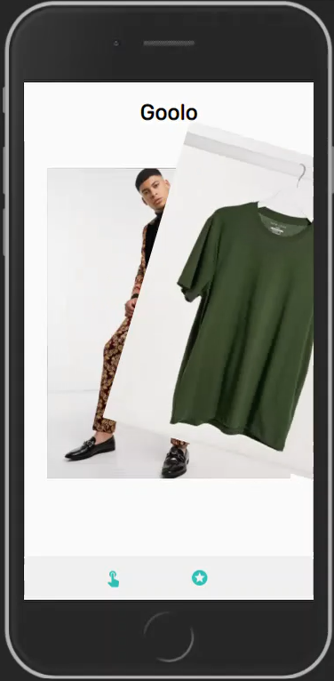
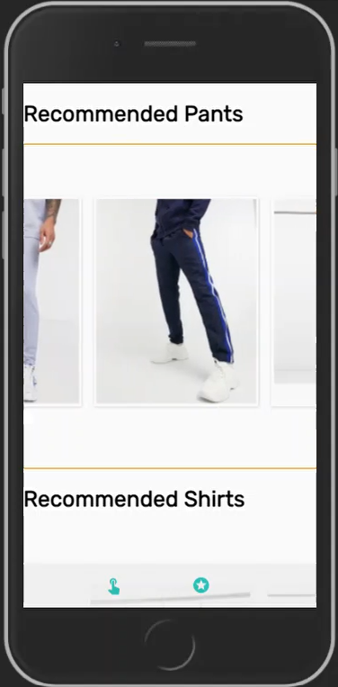

# Goolo 

Goolo is a swiper, which learns what you like and shows you exactly the clothes you like, all in one place and with
an interactive left/right swipe.
With a potential affiliation business model :) 

## Table Of Contents
- [Goolo](#Goolo)
  * [Why was Goolo made and why you should use it](#Why-was-Goolo-made-and-why-you-should-use-it)
  * [Running the project](#running-the-project)
  * [Screenshots](#screenshots)
    + [Goolo Swiper](#Goolo-Swiper)
    + [Goolo Recommendations](#Goolo-Recommendations)
  * [Technologies](#technologies)
    + [Client-Side](#client-side)
    + [Server-Side](#server-side)
  * [Whats Next](#whats-next)
  * [Be a contribute](#be-a-contribute)
  
## Why was Goolo made and why you should use it

1. I understood the world of not being able to 
   choose clothes is not my own concern.
2. Goolo helps me and I hope others to ease the pain
   of looking for the right clothes!
3. Are you a clothing shop?
   uncustomized buying experience 
   makes customers to bounce between websites in a chase after clothes they like, which leads to less sales.
   Feel free to use this open source code!
## Running the project

1. Clone the repo.
2. Run `npm install`.
3. enter the server folder.
4. run `nodemon server.js`.
5. go back to the root folder.
6. Run `npm start`.
7. Navigate to `http://localhost:3000`.

## Screenshots

### Goolo Swiper
An interactive swiper, you like it, you swipe it.
leave the rest to us :)

### Goolo Recommendations
Clothes recommended specificialy for you,
picked using our amazing algorithm!

## Technologies:

### Client-side:
* React.JS
* Mobx
* Sequelize
* Material-UI

### Server-side:
* Node.JS
* Express
* SQL

## What's next:
0. Fixing 3+ likes bug
1. Adding algorithm for recommended clothings on swiper 
2. Improving algorithm for recommendations
3. Adding affiliation to the app (because why not :))
4. Buy clothes the way its meant to be. 

## Be a contribute:

<a href="/CONTRIBUTION.md">Contribution Readme</a>

